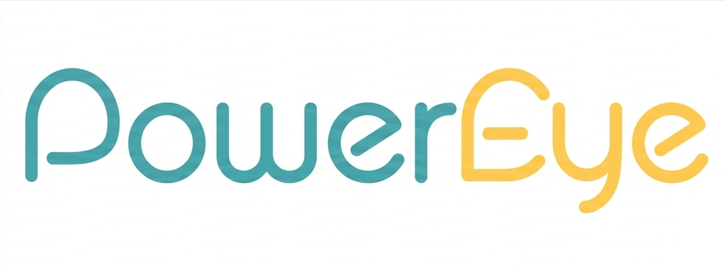
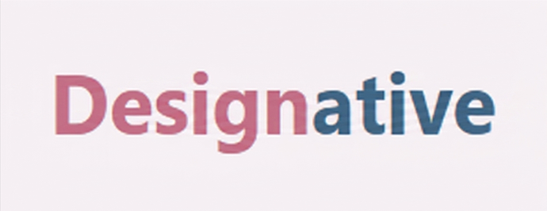

# Hi, I'm Raneem Balharith 👋

Frontend Developer | React.js | UI/UX Enthusiast | Computer Science Graduate

---

## 🚀 About Me
Frontend Developer specializing in building responsive and user-friendly web applications using React.js and modern JavaScript (ES6+). Passionate about creating clean UI, optimizing performance, and delivering seamless user experiences. Strong foundation in UI/UX design with a solid understanding of design systems and user-centered development.

---

## 🧠 Tech Stack

### Frontend Development

### Tools & Technologies

---

## 💼 Experience

### Frontend Developer (Internship)
*Innosoft SA | Jan 2024 – Jul 2024*

- Developed responsive user interfaces using React.js  
- Collaborated with designers and backend developers  
- Improved performance and cross-browser compatibility  
- Worked in Agile development environment  

---

## 🎓 Projects

###  PowerEye App (Graduation Project)

- React Native mobile application for energy monitoring  
- Flask backend + Firebase Cloud Messaging  
- Full Software Development Lifecycle (SDLC)

###  Designative (Full Stack University Project)

- Web application built using EJS, HTML, CSS, JavaScript, Bootstrap  
- Authentication system (login/register)  
- Team-based academic project  
📺 Demo video available

---

## 🏆 Highlights
- 1st Place Winner – CCSET Project Award (PSU)
- PwC Empowerthon Participant
- Participation in national innovation conferences

---

## 📫 Contact
- Email: balharith.raneem@gmail.com  
- LinkedIn: [linkedin.com/in/raneem-balharith-273a04289](https://www.linkedin.com/in/raneem-balharith-273a04289)
